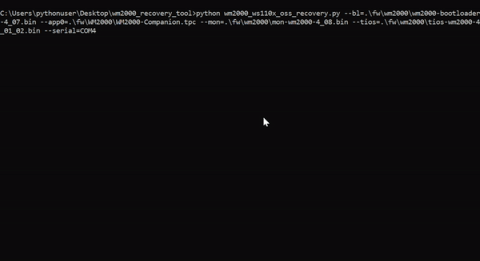
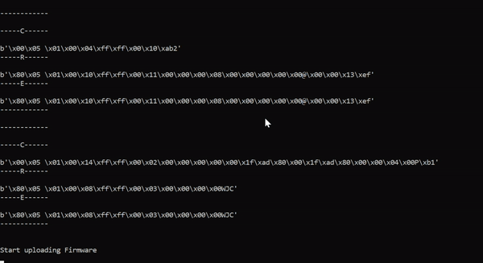

# Installing Python

Please download the latest Python for your OS. 

Make sure that the checkbox for "Add python.exe to PATH" is selected. If you wish to enable Python for all users, then select the "Use admin privilages when installing py.exe" checkbox.

You can now type "Python" in command prompt to see the version of installed Python. If you have other versions of Python installed, please use "Python3" or equivalent command for the version of Python you just installed.

# Installing the Required Components

After Python has sucessfully installed. Open command prompt in the WM2000_Recovery_Tool folder and issue "pip3 install -r requirements" to install the necessary components.

# Running the Recovery Tool

On the bottom of the WM2000EV there is a HM button. Press and hold this button then plug in the USB cable. Release the button and your board is ready to perform the update.

Now, with all the files prepared, you can run the command "python wm2000_ws1102_oss_recovery.py" wtih appropriate fields, it should proceed and look something like below.

